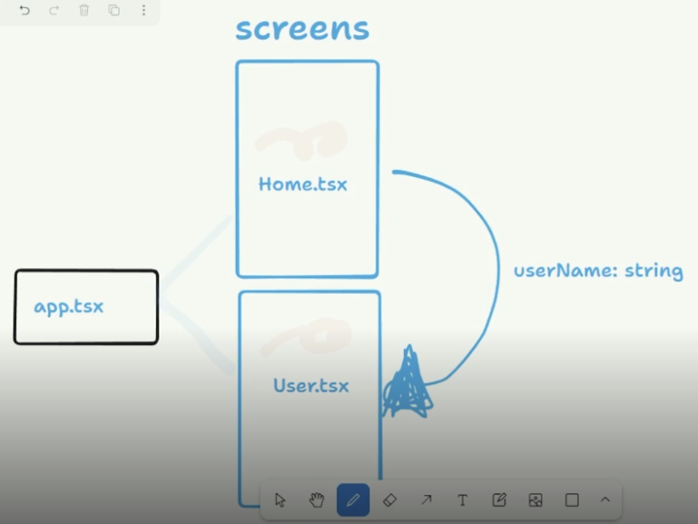
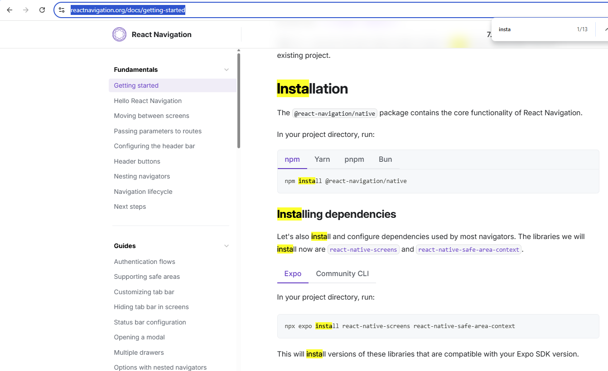

# Introduction

Teacher said that our challenge will be send a value rom one screen to ohter screen.




# Creating the test project

First, you need to create the project with this command

```sh
npx create-expo-app aula-context
```

Then you can install some dependencies as you can see in the [documentation](https://reactnavigation.org/docs/getting-started).

```sh
npx expo install react-native-screens react-native-safe-area-context
```

This two steps you can see in this area of the documentation:

